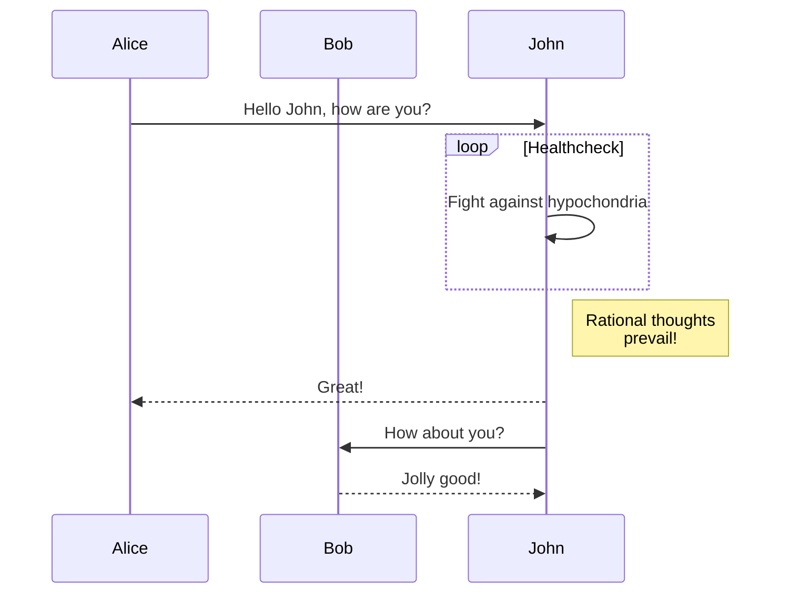
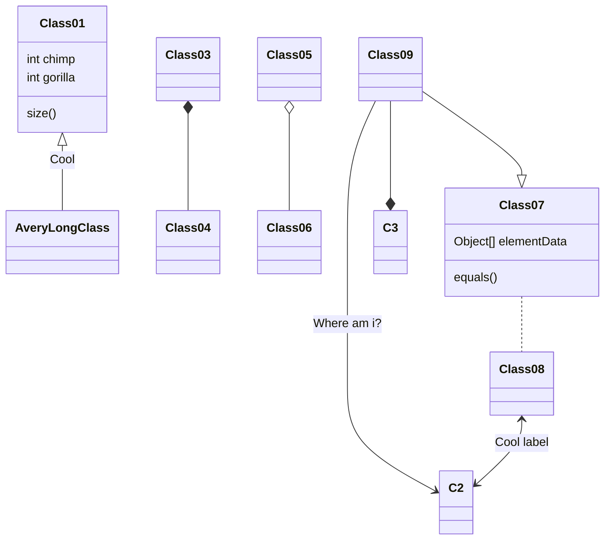
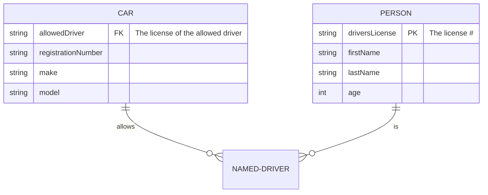

# gitlek

```javascript
let a = "hello";
```
```java
public class Main {
  public static void main(String[] args) {
    System.out.println("Hello World");
  }
}
```

 

[Länk till Google](https://www.google.com)

| Table | Table |
| ----------- | ----------- |
| Table | Table | Title    |
| Table | Table |

**This is bold text**
*This is italic text*

:smiling_imp: dont mess with me

* * *

- This is one
- This is two
- This is three

> “Be who you are and say what you feel, because those who mind don’t matter and those who matter don’t mind.”

– Bernard M. Baruch

This is a ``highlighted``word :) 

# Sequence Diagram

# Class diagram

# ER Diagram


